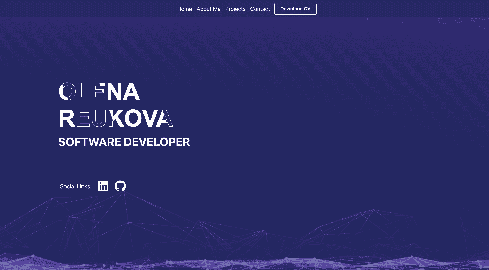

## Olena Reukova's Portfolio

## Welcome to my portfolio!

This portfolio showcases my skills, projects, and information about me as a Full Stack Developer.

#### Content

About Me\
Projects\
Contact

#### Introduction

This portfolio serves as a platform to demonstrate my capabilities as a Full Stack Developer.\
It includes information about my skills, projects I have worked on, and ways to get in touch with me.

#### Features

**Responsive Design** The portfolio is designed to be fully responsive, ensuring a seamless experience across various devices.\
**Navigation** Easy navigation with a navbar and smooth scrolling to different sections of the portfolio.\
**About Me** A section providing information about my technical skills.\
**Projects** Showcases a selection of projects I've worked on, including descriptions, technologies used, and links to GitHub repositories and live demos.

**Technologies used:** React.js, Styled-Components.
**How to Install and Run the Project:**

1. Clone the repository.
2. Run `yarn install` to install dependencies.
3. Run `yarn start` to start the development server.

#### Contact

kronverk01@gmail.com\
[LinkedIn](http://www.linkedin.com/in/olenareukova/ "LinkedIn")\
[Codewars](https://www.codewars.com/users/OlenaReukova "Codewars")
